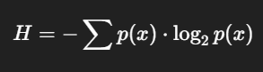

# Key Features of MalVisor
### **1. Entropy calculation**
- Calculates Shannon entropy of a binary blob. 
- High entropy may indicate compressed/encrypted sections.

**Logic**:
- Count how often each byte (0-255) appears.
- Shannon entropy formula:

### **2. String Extraction**
- strings command to find human-readable strings in binary files.

**Logic**:
- Read the file byte-by-byte.
- Collect sequences of printable characters longer than min_length.
- Return them in a list.

### **3. Disassemble_code**
- Disassemble binary machine code into assembly instructions using `capstone`.

- **Logic**:
- Uses Capstone's x86 32-bit disassembler (CS_ARCH_X86, CS_MODE_32).
- Returns the mnemonic and op_str (e.g., mov eax, ebx).

### **4. Extract PE features**
- Main function that extracts all features from a PE file using `pefile`.

**Step-by-step Logic**: 
1. `Load PE`: Parses the file as a PE. If it fails, returns an error.

2. `Header Fields`: Pulls basic header info from the PE.

3. `Sections and Entropy`: Iterates over all sections (e.g., .text, .data).

- `Extracts`:
    - Section name
    - Virtual address
    - Size
    - Entropy

4. `Imports`: Gathers imported DLLs and their functions.

5. `Exports`: Lists exported functions (usually for DLLs).

6. `Disassembly`: Takes first 200 bytes of code (usually .text section) and Disassembles them.

7. `Strings`: Extracts printable strings from the file.
